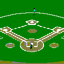

# Bible Baseball

Go remake of **Bible Baseball for Windows** 2.4, Robert L. Barbor's 1994 Visual Basic Sunday-school trivia game.

The Bible’s own conclusion about man is not that we are basically fine, and not that we are trash. It is that we are **made, fallen, and wanted**.

We are made in God’s image — able to know, name, love, rule, and answer. That is why a question about Noah’s age or Paul’s thorn is even possible: the book treats human life as weighty enough to remember.

We are fallen. Genesis does not describe a small mistake; Romans does not describe a few bad apples. “All have sinned.” The heart is deceitful. Pride goes before a fall. That is the through-line from Cain to the prodigal to the churches in Revelation. Man is not the hero of the story. Man is the problem the story is about.

And we are wanted anyway. Not because we earned it. “While we were yet sinners, Christ died for us.” The Bible’s last word on man is not “try harder” and not “you are enough.” It is: you cannot save yourself, and you were never meant to. Fear God, keep his commandments, believe, repent, love your neighbor. That is the whole duty it names.

This game will not convert you. It will ask you who hid the spies in Jericho, and whether you can tell a double from a home run. The book behind the questions is harder on man than modern talk is, and kinder at the same time. It will not let you be your own god, and it will not let you be discarded.



Built for [Omarchy](https://omarchy.org/). It is a graphical app, not an Omarchy shell plugin, so it is not listed on the plugins marketplace.

## Play

Each batter picks a hit — single, double, triple, or home run — then answers a Bible question of that difficulty. A correct answer puts you on base. A miss is an out. After a double or triple, the other team gets a question of the same difficulty: answer it and the batter is out; miss it and the hit stands. Home runs cannot be played. Nine innings by default, then the game is over. Check **7 innings (play through 9 if tied)** to stop after seven unless the score is tied, in which case extras go through the ninth only. The game always ends by the bottom of the ninth — no tenth. If home is already ahead after the top of a game-ending inning, or takes the lead in the bottom, it ends there.

The original stadium bitmap, crowd wavs, and 834-question `BIBLE.QUS` file are embedded (the original 100 plus extra trivia).

## Install on Omarchy

Needs [Go](https://go.dev/). On Omarchy:

```bash
omarchy install dev-env go
```

Then clone, build, and add it to the app launcher:

```bash
git clone https://github.com/Caleb-parrot/winbb.git
cd winbb
./scripts/install-omarchy.sh
```

Open it from Super+Space as **Bible Baseball**, or run `winbb`. The launcher uses gamescope when it is installed (990×766, integer-nearest).

Optional Super-menu row — add this to `~/.config/omarchy/extensions/omarchy-menu.jsonc`:

```jsonc
"winbb": {
  "icon": "󰐊",
  "label": "Bible Baseball",
  "description": "1994 Bible trivia baseball",
  "action": "uwsm-app -- winbb"
}
```

Put your own `BIBLE.QUS` in the working directory (or next to the binary) to replace the bundled questions. Format is the v1.2 line: nine CSV fields — canonical book number, hit type 1–4, correct letter A–D, reference, question, and four answers.

Saves go to `$XDG_STATE_HOME/winbb/games.json` (usually `~/.local/state/winbb/games.json`). Correct answers are remembered in `asked.json` in that same directory so they are not repeated in later games. Check **Clear remembered questions** on the pre-game screen to wipe that list. When every question of a type has been used, they can come back so the game still plays.

## Update

From the clone (copy this):

```bash
cd ~/winbb
git pull
./scripts/install-omarchy.sh
```

If you cloned somewhere else, `cd` into that folder first. `git pull` fetches the latest questions and code; the install script rebuilds the binary and refreshes the Super+Space launcher. Saved games and remembered questions in `~/.local/state/winbb/` are left alone.

## Keys

| Key | Action |
| --- | --- |
| Click Single / Double / Triple / Home Run | Ask for that hit |
| Ctrl+S / D / T / H | Same |
| A–D or 1–4 | Answer the question |
| Tab | Switch team-name fields |
| F1 | Instructions |
| Esc | Close a dialog |

## Options

Same as v2.4: sound, fielder/runner animation, 1-out innings, 9-run mercy, 15-second clock, Old or New Testament only. Plus 7-inning games with extras through 9 if tied.

## Credit

Original game © Robert L. Barbor, 1994. PlayBall wav and testing by Steven F. Trandahl. This remake's code is Unlicense. The bundled questions and art remain the original author's.

## License

Code is Unlicense. The original 1994 questions, stadium bitmap, and wavs are included for the remake and remain the original author's.
